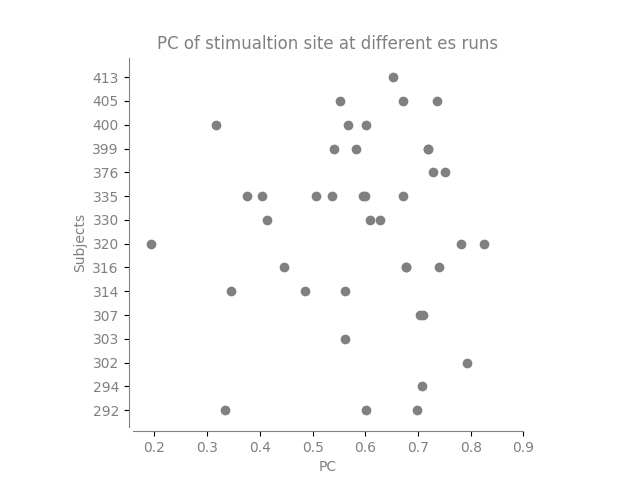
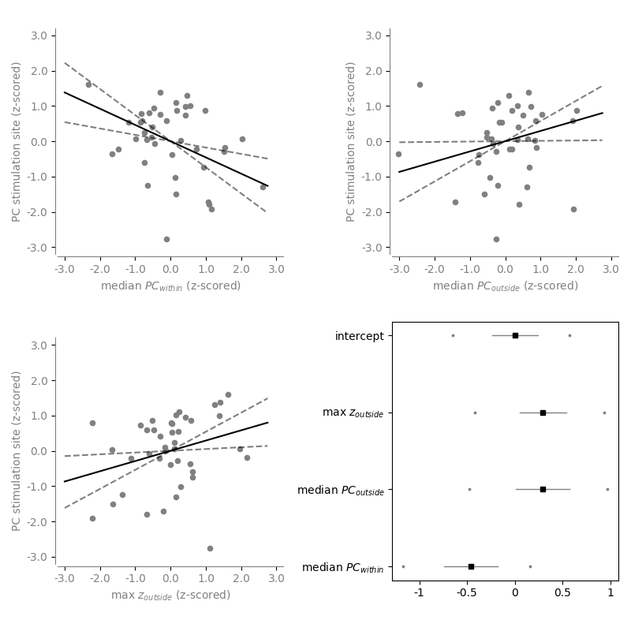

# Analysis 2

Analysis 2 creates a statistical model that takes into consideration whether the PC at the stimulation site effects the role.

First, we can observe that the PC at the parcel associated with the stimulation varies across different runs.

We see there is a spread from low PC to high PC across the stimulation sites.

Next, the we tried to fit the best model

$$PC_{stim-site} ~ \alpha + \beta_1 D(median(PC))_{within} + \beta_2 D(median(PC))_{outside}$$

Where D(median(PC)) is the difference in the median PC between es-on and es-off. Within and outside are the nodes belonging to the stimulation site's community and outside the stimulation site's community.

The displacement values and PC at stimsite where standardized to have a mean of 0 and standard deviation of 1 before the model. Below is the posterior distributions after MCMC sampling:

## Contents

### calc_pc_stimsite.py

The output of this is one figure showing the participation coefficient at the different stim sites (`figures/pc_at_stimsite.png/svg`). It also produces a file called `./data/pc_at_stimulus.tsv` which contains the PC estimate of each stimulation site per subject/run.

### trainmodels.py

This script tries to fit a linear Bayesian model between the PC at the stimulation site and the different median displacement values.
This produces 15 different traces which can be found in `./data/traces/`.
The different models are compared with WAIC and LOO and founds in `./data/model_fit_loo.tsv` and `./data/model_fit_waic.tsv`.

### plot_best_model.py

This script produces:

1.  The posterior predictive checks of the best fitting model (pc_within and pc_outside). These are the p-values of the mean and IQR and are found in `./data/ppc_bestmodel.tsv`

2.  The Gelman-Rubin statistic of the best fitting model. This is found in `./data/gelmanrubin_bestmodel.tsv`
3.  A figure of the posterior distributions of the best model. This is found in `figures/posterior.png/svg`

## Major difference from pre-registration

The initial pre-registered plan was to calculate the es per stimulation sequence (i.e. multiple connectivity estimates per run) and then place this in a hierarhical statistical model with subject as a layer. When writing the preregistration, we did not realize that this would only be <10 data points per stimulation run. We deemed this too few to get a accurate and this analysis was never performed. Instead, we did away. However, because there was no longer multiple PC estimates for each stimulation site, we now needed to use the displacement (i.e. es-on - es-off) instead of just es-on. Without comparing the change to baseline, the values will be hard to compare, as the stimulation sites may belong to communities with different PC-properties. Thus, we had to use the displacement values here to achieve meaningful results.