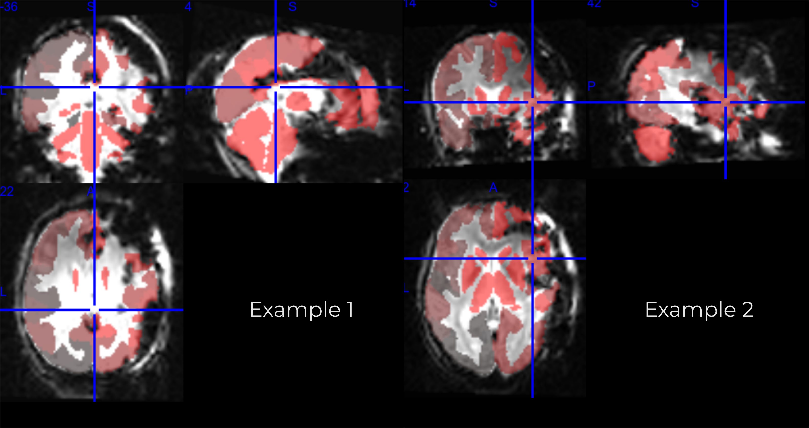

# Masking of es-fmri data

The purpose of this repo is to take the "frankenstein" atlas in the parcellation subdirectory and apply it to each subject.

Since there is considerable dropout, we first select voxels which we decide to keep. Here is an example of the output we create from this:

Here we see the remaining parcellation after the mask has been applied.

## To replicate

To create our steps this you will need to change line 9 in `create_avgvoxdist` and specify where the BIDS directory of the esfMRI data is.

To replicate the exact steps we did, we ran this in a singularity container. We did:

`docker run -v /var/run/docker.sock:/var/run/docker.sock -v /home/william/work/esfmri_connectivity/:/output --privileged -t --rm quay.io/singularity/docker2singularity esfmri`

To create the singularity container. Then launched an interactive session with: `singularity run esfmri*.simg` navigated to the esfmri_connectivity directory and then ran the code in `create_goodvoxel_mask.py`. It is however possible to mount the esfMRI data and run inside the docker container (and bids_dir points to where it is mounted within the docker container). This step creates the contents in `avg_voxel_distribution` directory.

Next we ran:

`docker run -u esfmri -v $(pwd):/home/esfmri/ -t esfmri python -m esfmri_connectivity.preprocessing.goodvoxel_masks.plot_gmm`

This creates all the figures in `./avg_voxel_distribution/gmm_figures/`.

We evaluated each of these figures and chose that having 4 Gaussians and taking the top 3 Gaussians (marking all voxels belonging to Gaussian with the lowest mean as "bad") was the best approach for us to reject the lower part of the distribution. Compared to only selecting 2 Gaussians, this made the cut-off point lower, including more data (see figures). We selected voxels based on which Gaussian they are most likely to belong to. This varies slightly from the preregistration, but helped us deal with less Gaussian distributions.

Then, to create a unique mask for each subject, we ran:

docker run -u esfmri -v $(pwd):/home/esfmri/ -t esfmri python -m esfmri_connectivity.preprocessing.goodvoxel_masks.create_mask

This will create the masked frankenstein atlas in `masks` for each subject. Voxels that are marked as "bad" are not included in the parcellation. If 50% of the voxels are marked as bad, the parcel is removed. This also creates a `parceldelete_report.tsv` saying how many parcels were deleted from each subject/task combo.

The final contents of this, are example.png and example.svg which were manually made by looking at two different subjects to see how well the parcellation overlaps with a single volume of the BOLD data.
